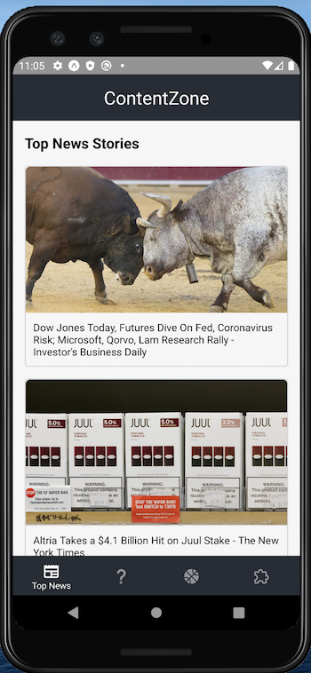
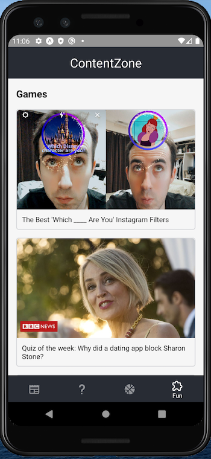

# contentzone

React native prototype that explores using a news api to 
aggregate content

# Installing

You can install the app on your android phone by downloading the [Expo](https://play.google.com/store/apps/details?id=host.exp.exponent&hl=en_US) app and scanning the qr code below. An apk file will also be added to the repo shortly.

# screens

